# CloudForms 4.5 with Ansible batteries included

This lab will guide you through the process of using the new embedded Ansible features of CloudForms 4.5.

## Introduction to CloudForms

[General introduction](../../common/index.md)

## Setup the lab environment

To complete this lab, you will need to deploy an environment. Each student has their dedicated environment. To order a lab, navigate to [http://cfme.rhepds.com](http://cfme.rhepds.com).

1. Log in to with your station name lu&lt;number&gt; with password "Frank_&lt;number&gt;_furt". The number &lt;number&gt; matches the number of your lab notebook.

    

1. click on the lab "CloudForms 4.5 with Ansible" and on ***Order***

    

1. read the details. Note that each lab will be automatically deleted after one day and shut down after 8 hours

1. click on ***Submit*** to start the provisioning of the lab

    ***Note*** It will take up to 15 minutes for the lab to deploy! If you get a "Service unavailable" error, just wait a minute and try to reload.

    ***Note:*** You can only deploy one lab at a given time! If you try to deploy another lab, any previously created labs will be deleted!

## Access the lab environment

***Note:*** Give the lab up to 15 minutes to complete provisioning!

The lab is comprised of a number of systems:

* Red Hat CloudForms Management Engine

        URL: https://cf-lu<number>.labs.rhepds.com

        User: demo / password: r3dh4t1!

* Red Hat Enterprise Virtualization Manager

        URL: https://rhevm-lu<number>.labs.rhepds.com

        User: admin@internal / password: r3dh4t1!

* Red Hat OpenStack Platform

        URL: https://osp-lu<number>.labs.rhepds.com

        User: admin / password: r3dh4t1!

* VMware vCenter

        URL: https://vcenter-lu<number>.labs.rhepds.com

        User: root / password: r3dh4t1!

The number &lt;number&gt; matches the number of your lab notebook.

***Note:*** Your browser might give you a warning message about the used SSL Certificates. These warning messages can be accepted and are due to the fact that each lab deployed with new certificates on request.

## Introduction to Ansible

Today, every business is a digital business. Technology is your innovation engine, and delivering your applications faster helps you win. Historically, that required a lot of manual effort and complicated coordination. But today, there is Ansible - the simple, yet powerful IT automation engine that thousands of companies are using to drive complexity out of their environments and accelerate DevOps initiatives.

Red Hat CloudForms can integrate with IaaS, PaaS, public and private cloud and configuration management providers. Since version 4.2 of CloudForms, it can also integrate with Ansible Tower by Red Hat. The latest version which is 4.5, has a new "embedded Ansible" role which allows it to run Playbooks, manage credentials and retrieve Playbooks from a source control management like git.

This integration allows customers to build service catalogs from Ansible Playbooks to allow end users to easily browse, order and manage resources from Ansible. Ansible Playbooks can be used in Control Policies which can not only detect problems, but also automatically fix them.

## Verify Lab

### Make sure embedded Ansible role is enabled and running

Before we start,  we want to make sure the embedded Ansible role is enabled and running.

1. Log into your CloudForms Appliance

1. Click on your user name on the top right and click on ***Configuration***

    

1. Make sure the "Embedded Ansible" Role is enabled

    

1. Click on ***Diagnostics*** in the accordion on the left and click on the ***Workers*** tab

1. Make sure you can see a line indicating the "Embedded Ansible Worker" is in state "started"

    

### OpenStack Provider status

Let's now check the OpenStack Provider:

1. Navigate to ***Compute*** -> ***Clouds*** -> ***Providers***

    

1. You should see a tile icon labeled "OpenStack". Click on it.

    

1. Click on ***Authentication*** -> ***Re-check Authentication Status***

    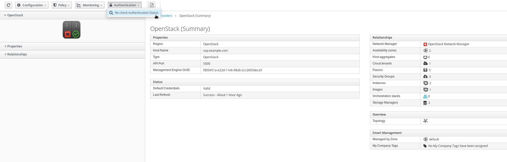

This will validate the credentials are correct, and it will also restart the provider specific background processes.

After reloading the page, the provider tile should show a green check mark and the last update fields should report "less than a minute ago".

### Red Hat Virtualization Provider status

Let's then check the RHV Provider:

1. Navigate to ***Compute*** -> ***Infrastructure*** -> ***Providers***

    

1. You should see a tile icon labeled "OpenStack". Click on it.

    

1. Click on ***Authentication*** -> ***Re-check Authentication Status***

    

This will validate the credentials are correct, and it will also restart the provider specific background processes.

### vCenter Provider status

Last but not least, let's check the vCenter Provider:

1. Navigate to ***Compute*** -> ***Infrastructure*** -> ***Providers***

    

1. You should see a tile icon labeled "vCenter". Click on it.

    

1. Click on ***Authentication*** -> ***Re-check Authentication Status***

    

This will validate the credentials are correct, and it will also restart the provider specific background processes.

1. Go back to ***Compute*** -> ***Infrastructure*** -> ***Providers***

    

1. Check all providers show a green check mark

    

1. Now you're ready to go!

## Add a Git repository of Ansible Playbooks

To be able to run Ansible Playbooks, they have to become available in CloudForms. Custom git repositories can be used as well as Github, Gitlab or others. Other repository types like Subversion or Mercurial are planned for later versions.

1. Navigate to Automation, Automate, Repositories.

    

1. Click on ***Configuration***, ***Add New Repository***

1. Fill in the form.

    ***Name:*** Github

    ***Description:*** Example Playbooks

    ***URL:*** [https://github.com/cbolz/rhte-fy18/tree/master/playbooks](https://github.com/cbolz/rhte-fy18/tree/master/playbooks.git)

    ***SCM Update Options:*** check "Update on Launch"

    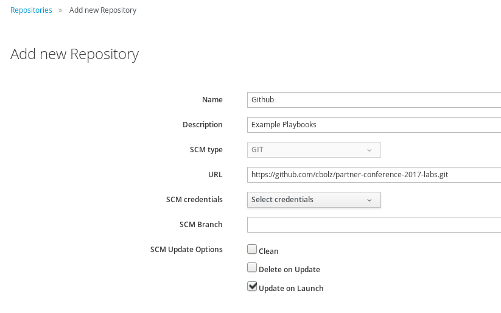

1. Click on ***Add*** to save the settings

***Note:*** It takes a few seconds for the action to complete. A pop up notification will inform you after the task was completed.

## Add vCenter credentials

For one of the following labs, the Playbook needs to be able to log into the vCenter provider. For this to work, we need to store the necessary credentials.

1. Navigate to ***Automation*** -> ***Ansible*** -> ***Credentials***

    

1. Click on ***Configuration*** -> ***Add New Credentials***

1. Provide the credentials in the form:

    ***Name:*** vCenter

    ***Credentials Type:*** VMware

    ***Username:*** root

    ***Password:*** r3dh4t1!

    ***vCenter Host:*** vcenter.example.com

    

1. Click ***Add*** to save the credentials

***Note:*** It takes a few seconds for the action to complete. A pop up notification will inform you after the task was completed. You can track the progress in the Tasks section.

In the top right corner of the screen navigate to ***Administrator*** -> ***Tasks***

And click in ***All Other Tasks***

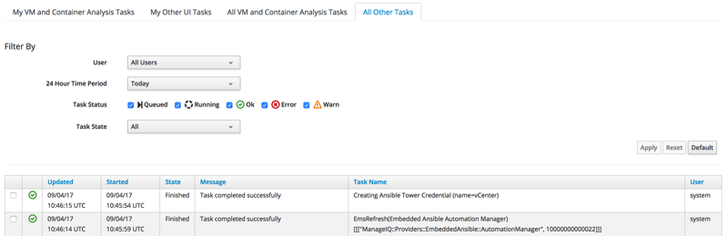

## Verify repository sync

In the meantime the repository you created should have completed the initial synchronization. Let's check all Playbooks have been successfully imported and are available for us to use.

1. Navigate to ***Automation*** -> ***Ansible*** -> ***Playbooks***

    

1. You should see a list of available Playbooks

    

If there are no Playbooks listed, check the repository was configured correctly. Click the notification icon on the top right (the little bell icon) and check if there are any errors listed. The initial import can also take a minute or two, did you wait long enough?

## Build a Service Catalog to create and delete users

In this lab we will use an Ansible Playbook to create a local user in CloudForms. This example will also demonstrate how we can define a retirement process as well. In CloudForms' understanding of complete life cycle management, every object has a provisioning and a retirement workflow.

### Create a Service Catalog for Ansible Playbooks

1. Navigate to ***Services*** -> ***Catalogs***

    

1. Click on ***Catalogs*** in the accordion on the left

1. Click on ***Configuration*** -> ***Add a New Catalog***

    ***Name:*** Ansible

    ***Description:*** Ansible Service Catalog Items

    

1. Click ***Add*** to save the new catalog

### Create a Service Catalog Item for the Playbook

1. Click on ***Catalog Items*** in the accordion on the left

    

1. Click on ***Configuration*** -> ***Add a New Catalog Item***

1. Select ***Ansible Playbook*** as "Catalog Item Type"

    

    ***Note:*** Do not select Ansible Tower! We do not use Ansible Tower in this lab, but the embedded Ansible role of CloudForms.

1. Fill out the form to define the service catalog item:

    ***Name:*** Create User

    ***Description:*** Order this catalog item to create a new user

    ***Display in Catalog:*** Yes (check the box)

    ***Catalog:*** Ansible

    ***Repository:*** Github

    ***Playbook:*** create-user.yml

    ***Machine Credentials:*** CFME Default Credentials

    In the box ***Variables & Default Values*** we can enter the variables the Playbook requires:

    ***Variable:*** create_user_name

    ***Default:*** example

    Click on the little plus icon (+) to save the variable. Repeat the process for the second variable:

    ***Variable:*** create_user_password

    ***Default:*** secret

    Click on the little plus icon (+) to save the variable.

    ***Dialog:*** create new

    ***Dialog name:*** create-user

    

1. Click on the tab ***Retirement*** to switch to the second page of the form.

    ***Repository:*** Github

    ***Playbook:*** delete-user.yml

    ***Machine Credentials:*** CFME Default Credentials

    There are no variables needed for retirement and the ***Variables & Default Values*** can be left empty.

    

1. Click on ***Add*** to save the catalog item

## Order the "create user" Service Catalog Item

To make sure everything works as expected, we want to test the Catalog Item we just created.

1. Navigate to the Service Catalog by clicking on ***Services*** -> ***Catalogs***

    

1. Click on ***Service Catalog*** in the accordion on the left

1. Click on the Catalog Item you just created:

    

1. Click ***Order***

1. The default values in the form can be left alone. Optionally you can specify a different user name and password

    

1. Click ***Submit***

    After clicking "Submit" you will be redirected to the Request Queue.

    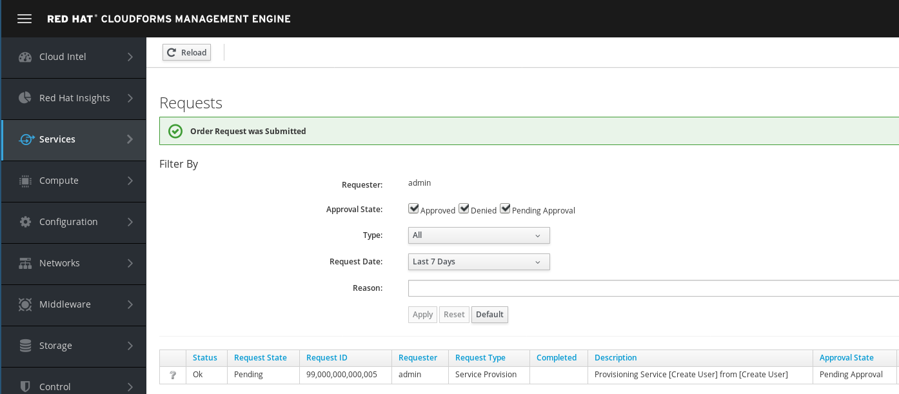

### Monitor create user Playbook execution

When executing an Ansible Playbook with the embedded role in CloudForms, a "Service" object is automatically created. This service object gives us more details about the executed Playbook. It provides the output of the Playbook and it allows us to trigger retirement.

1. Navigate to ***Services*** -> ***My Services***

    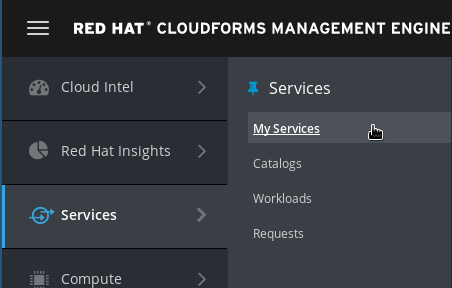

1. You should see a new tile representing the Ansible Playbook Service you just ordered

    ***Note:*** If you don't see the tile yet, wait a minute and try again.

    

1. After clicking on the icon, we can see more details about the service which was created

    

    Since this Service does not create a Virtual Machine, the box "VMs" will always say "No Records found"

1. Click on the ***Provisioning*** tab to see the output of the Ansible Playbook

    

    If the Playbook execution has not completed, you can click the reload icon to refresh the information. The ***Reload*** icon is represented by a little arrow, left of the ***Configuration*** menu.

    

    ***Note:*** If the Playbook execution has not started yet, you might not see any details in the "Provisioning" tab. Wait a minute and reload once more.

### Verify Playbook results

To make sure the user was really created, follow these steps.

1. Click on your username on the top right and click on ***Configuration***

    

1. Click on ***Access Control*** in the accordion on the left

    

1. Click on ***Users*** and you should see the user you just created (in this screenshot the user is called "example")

    

1. OPTIONALLY: If you want, you can log out of CloudForms and try to log in with the user you just created. Click on your username on the top right and ***Logout***.

    

## Build a Service Catalog to deploy Virtual Machines

In this second part of the lab we want to use an Ansible Playbook to deploy a Virtual Machine in VMware vCenter. The necessary Playbook should already be in your repository.

1. Click on ***Catalog Items*** in the accordion on the left

    

1. Click on ***Configuration*** -> ***Add a New Catalog Item***

1. Select ***Ansible Playbook*** as "Catalog Item Type"

    

    ***Note:*** Do not select Ansible Tower! We do not use Ansible Tower in this lab, but the embedded Ansible role of CloudForms.

1. Fill out the form to define the Service Catalog Item:

    The name of the Service Catalog Item:

    ***Name:*** Provision Virtual Machine

    More description details about the Service Catalog Item

    ***Description:*** Order this catalog item provision a Virtual Machine on VMware vCenter

    Check this box to make the Service Catalog Item visible in the Service Catalog. This remains unselected for Service Catalog Items which are still in draft mode or should only be used as a part of a Service Catalog Bundle:

    ***Display in Catalog:*** Yes (check the box)

    The Service Catalog in which this Service Catalog Item should be listed:

    ***Catalog:*** Ansible

    The Git repository from which we want to run our Playbook:

    ***Repository:*** Github

    The name of the actual Playbook:

    ***Playbook:*** create_vm_from_template.yml

    Credentials used to run the Playbook:

    ***Machine Credentials:*** CFME Default Credentials

    If you want to run your Playbook against a Cloud Provider, you have to select which one:

    ***Cloud Type:*** VMware

    The credentials used to log into the Cloud Provider:

    ***Cloud Credentials:*** vCenter

    In the box ***Variables & Default Values*** we can enter the variables the Playbook requires. Those variables are defined in the Ansible Playbook. By specifying them here, CloudForms can populated those variables when somebody order the Service Catalog Item.

    If you want to learn more about variables in Ansible Playbooks, have a look at the [Ansible Documentation](http://docs.ansible.com/ansible/playbooks_variables.html).

    ***Variable:*** vcenter_hostname

    ***Default:*** vcenter.example.com

    Click on the little plus icon (+) to save the variable. Repeat the process for the second variable:

    ***Variable:*** esxi_host

    ***Default:*** 192.168.0.51

    Click on the little plus icon (+) to save the variable. Repeat the process for the second variable:

    ***Variable:*** datacenter

    ***Default:*** DC01

    Click on the little plus icon (+) to save the variable. Repeat the process for the second variable:

    ***Variable:*** template

    ***Default:*** rhel6tmpl

    Click on the little plus icon (+) to save the variable. Repeat the process for the second variable:

    ***Variable:*** vmname

    ***Default:*** changeme

    Click on the little plus icon (+) to save the variable.

    ***Dialog:*** create new

    ***Dialog name:*** provision-vm-vcenter

    

1. Click on ***Add*** to save the Service Catalog Item. It can take a few moments for the changes to be saved.

    

## Order the Virtual Machine Provisioning Service Catalog Item

Once more, we want to test the result and see everything works as expected.

1. Navigate to ***Services*** -> ***Catalogs***

    

1. Click on the Service Catalog Item we just created "Provision Virtual Machine"

    

1. Click ***Order***

1. If you specified the dialog elements like described before, your form should look like this and all the provided default values can be accepted.

    

1. Click on ***Submit***

    After you click on "Submit" you will be redirected to the requests queue.

    

### Monitor VM provisioning Playbook execution

When executing an Ansible Playbook with the embedded role in CloudForms, a "Service" object is automatically created. This service object gives us more details about the executed Playbook. It provides the output of the Playbook and it allows us to trigger retirement.

1. Navigate to ***Services*** -> ***My Services***

    

1. You should see a new tile representing the Ansible Playbook Service you just ordered

    ***Note:*** If you don't see the tile yet, wait a minute and try again.

    

1. After clicking on the icon, we can see more details about the service which was created

    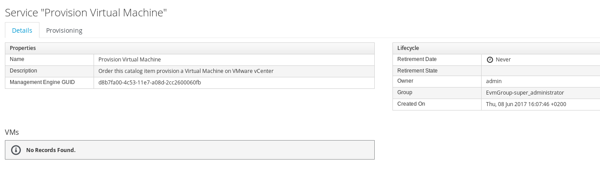

    Since this Service does not create a Virtual Machine, the box "VMs" will always say "No Records found"

1. Click on the ***Provisioning*** tab to see the output of the Ansible Playbook

    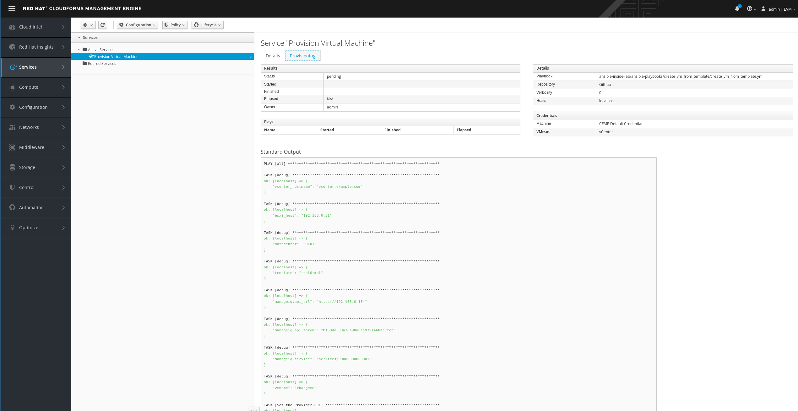

    If the Playbook execution has not completed, you can click the reload icon to refresh the information. The ***Reload*** icon is represented by a little arrow, left of the ***Configuration*** menu.

    

## Extend CloudForms builtin Capabilities

In this lab you have so far learned how to use Ansible Playbooks to orchestrate and execute configuration actions. CloudForms is internally using a powerful and extensible framework that defines what happens "under the hood". This feature is called "Automate". "Automate" allows us to understand how things are done and even more interestingly, it allows us to add features which are not coming out of the box.

"Automate" code can either be developed directly in the User Interface, or it can be imported from a Git repository. For this lab we want to keep things simple. We will add a Git repository with a simple method to make the Service Dialog easier to use.

### Add a Git repository for Automate

"Automate" code can either be developed and written directly in the CloudForms Web UI, or it can be imported from a Git repository. We will do the latter:

1. Navigate to ***Automation*** -> ***Automate*** -> ***Import/Export***

    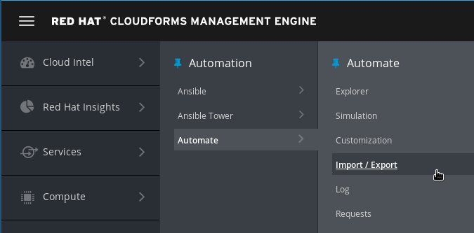

1. Use the following URL to access the Git repository:

    [https://github.com/cbolz/partner-conference-2017-labs.git](https://github.com/cbolz/partner-conference-2017-labs.git)

    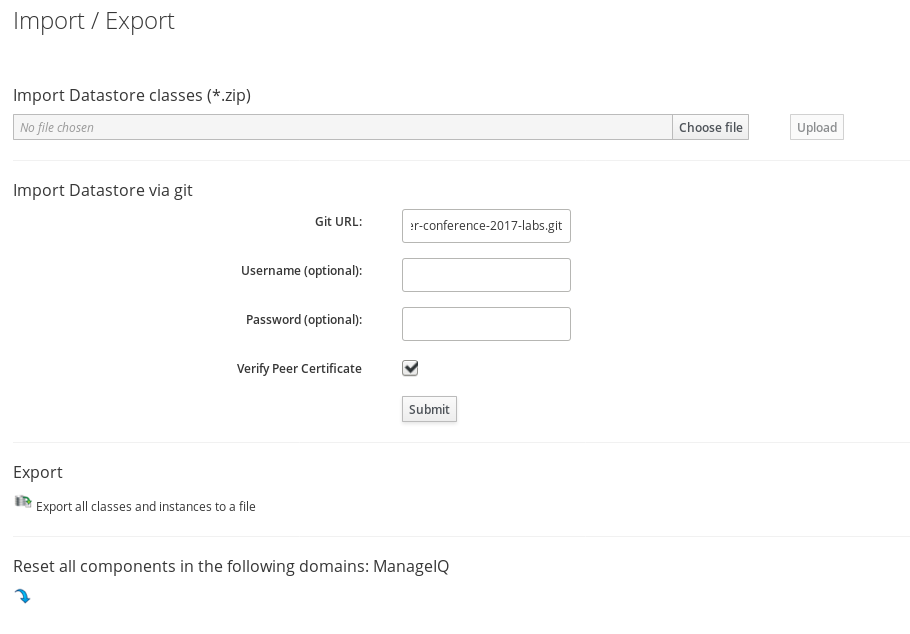

1. Click ***Submit***. It will take a few moments to check the Git repository.

1. The "Branch/Tag" and "Branch" fields allow us to import different tags or branches, for example "Development", "Testing", "QA", etc.

    For this lab, we stick with the defaults and click on ***Submit***

    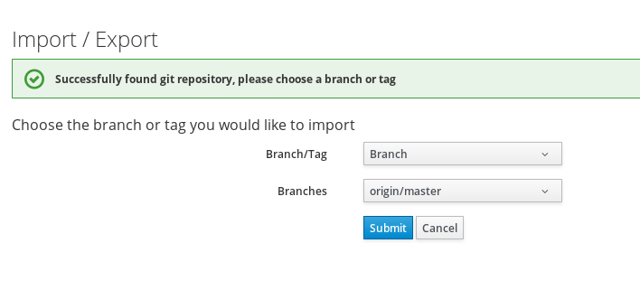

1. The first import can take a few moments. After that you should see the following confirmation:

    

### Verify Automate import

We want to make sure the Automate Code was properly imported.

1. Navigate to ***Automation*** -> ***Automate*** -> ***Explorer***

    

1. "Automate" code is organized in "Datastores". Two Datastores are shipped with CloudForms:

    * ManageIQ: These methods are a verbatim copy of the Open Source Community version
    * RedHat: These methods are only shipped with Red Hat CloudForms and are supported by Red Hat

    You can now see an additional third Datastore called "PConf17", which is the one you just imported. Users can create as many additional datastores as they want, but they can not modify or delete the two datastores shipped with the product. Datastores are stacked and prioritized which allows separation of out of the box functionality from custom code.

    The screenshot was created after expanding all folders (which are actually called "Namespaces" and "Classes":

    

This concludes the preparation for the next part of the lab.

## Optimize the Dialog

The Service Dialog we created so far, is not ideal for most use cases. We want users to focus on getting their service as quickly and easily as possible. An ideal Service Dialog only asks the absolutely necessary questions. With this in mind, we can optimize the automatically created Service Dialog created in the previous part of the lab.

1. Navigate to ***Automation*** -> ***Automate*** -> ***Customization***

    

1. Click on ***Service Dialog*** in the accordion on the left

    

1. Click on the Dialog which was created in the previous step "provision-vm-vcenter"

1. Click on ***Configuration*** -> ***Copy this Dialog***. We want to keep the original version of the Dialog, which will allow us to have a backup.

1. Edit the Label and Description to something a bit more meaningful

    ***Label:*** provision-vm-vcenter-v2

    ***Description:*** Optimized version of the Service Dialog

    ***Note:*** Do not click on ***Add*** yet, we want to do some more changes!

1. We want to do several changes on this Dialog.

    Change the Label to something more meaningful:

    ***Label:*** provision-vm-vcenter-v2

1. The elements in the "Options" box will always be left to the default values for our Service Catalog Item to work. Since our users are never going to change any of the field in the "Options" bix, we can simply delete the entire box.

    Click on the Box "Options" and then on the little trash bin icon to delete it and all its child elements.

    

    ***Note:*** Make sure you have highlighted the correct element! If you deleted the wrong element by accident, you can click on ***Cancel*** and start over.

1. The ESXi host which will actually create the virtual machine, is always the same in this lab. We can hide the element to simplify the Dialog further.

    Click on the Element "esxi_host" and unselect the "visible" box

    

1. The same applies for the "Datacenter". In this lab, there is only one.

    

1. To finish the our optimizations, we want to make the vCenter a dynamic drop down. Instead of providing possible values as a hard coded list, or asking the user for manual input, we can use program code to create a list of applicable options.

    In this example, we want the list of available vCenters dynamically populated (Although there is still only one vCenter and the value is questionable at best. But it's a good example of CloudForms' capabilities nonetheless)

    Click on the Element "vcenter_hostname" and change the type to "Drop down list". Then click the check box "Dynamic". This will change the form and show us new fields:

    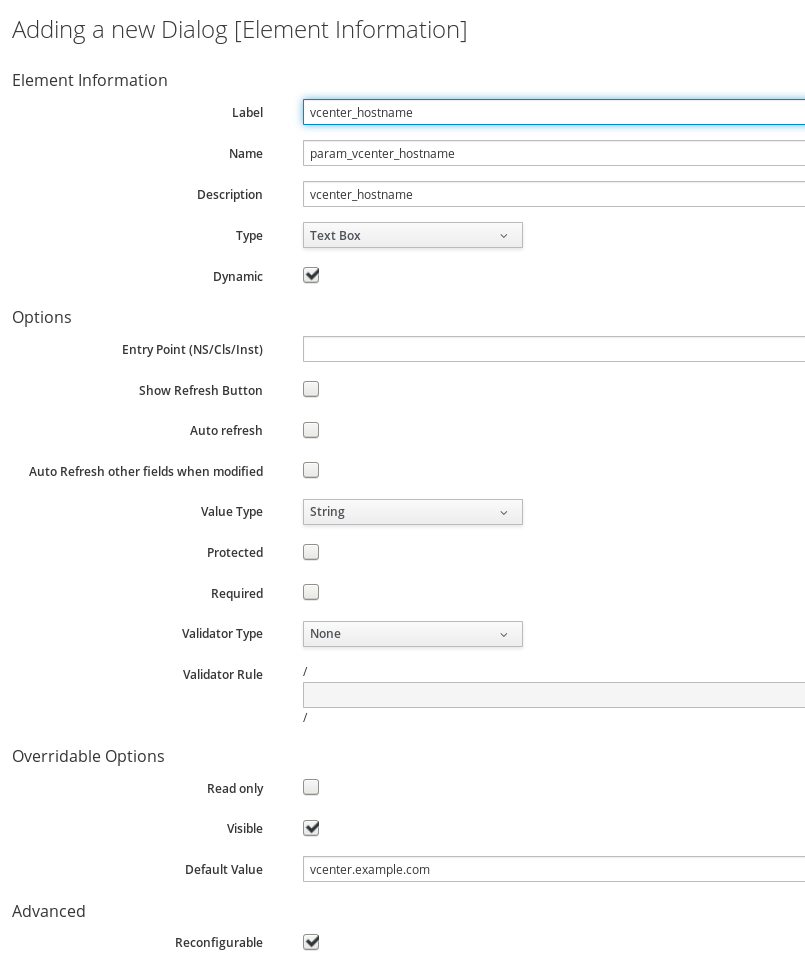

    Click on "Entry Point". A window will pop up which allows us to specify which method instance should be called to populate this Element.

    Select the Instance called "get_vcenter_list" and click ***Apply***.

    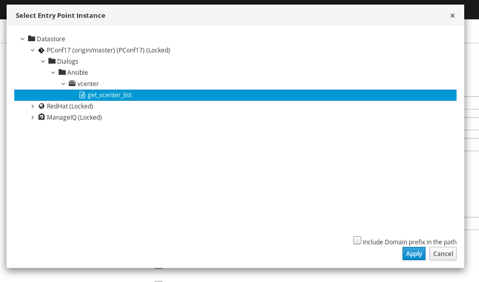

    The resulting Service Dialog Element should look like this:

    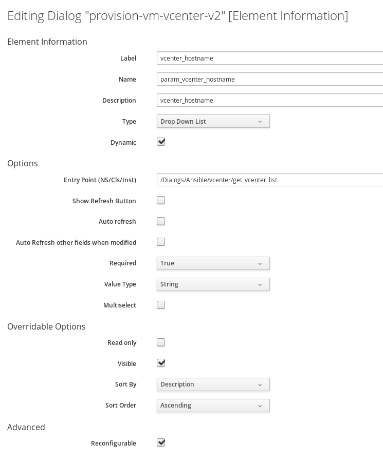

1. Click on ***Add** to save all changes

### Update the Service Catalog Item

We have to change the Service Catalog Item to use the Service Dialog we just created.

1. Navigate to ***Services*** -> ***Catalogs***

    

1. Navigate to ***Catalog Items*** in the accordion on the left and click on the "Provision Virtual Machine" Service Catalog Item

    

1. Click on ***Configuration*** -> ***Edit this Item***

1. In the ***Dialog*** Section of the UI, change the value from "provision-vm-vcenter" to "provision-vm-vcenter-v2"

    

1. Click ***Save*** to commit the changes

### Test the new Service Dialog

We want to see how the resulting Service Catalog Item looks like.

1. Navigate to ***Services*** -> ***Catalogs***

    

1. Make sure you are on the "Service Catalogs" tab in the accordion on the left

1. Order the "Provision Virtual Machine" Service Catalog Item

    

1. Note the Service Dialog has changed compared to before. You should notice a few fields are gone and the vCenter is now a drop down list. "vCenter" should already be selected for you.

    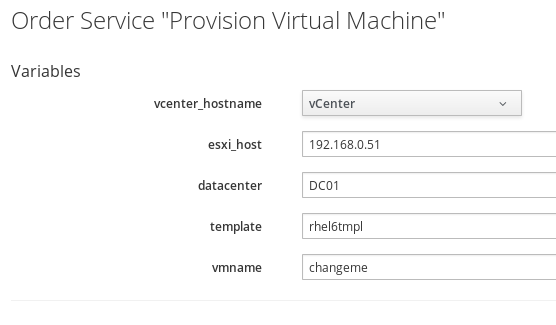

1. If you want, you can go ahead and submit the order

## Advanced Lab

If you're already done and still have some time left, here are some ideas for advanced labs:

* try to retire the "create user" service catalog item and see if the user is indeed deleted
* try to add other Playbooks, some examples can be found on the [Official Red Hat CloudForms Blog](http://cloudformsblog.redhat.com/2017/05/31/ansible-automation-inside-cloudforms/)
* retire the virtual machine Service you ordered earlier, check what happens during retirement with the virtual machine (Is it shutdown? Deleted? Is there still a representation in the CloudForms Web UI?)