# Build a Service Catalog with CloudForms

This lab will guide you through the process of creating a service catalog in CloudForms.

## Introduction to CloudForms

[General introduction](../../common/index.md)

## Setup the lab environment

To complete this lab, you will need to deploy an test environment. Each student can setup their dedicated environment. To order a lab, navigate to [http://cfme.rhepds.com](http://cfme.rhepds.com).

1. Log in with your station name lu&lt;number&gt; with password "Frank_&lt;number&gt;_furt". The number &lt;number&gt; matches the number of your lab notebook.

1. Navigate to the service catalog

    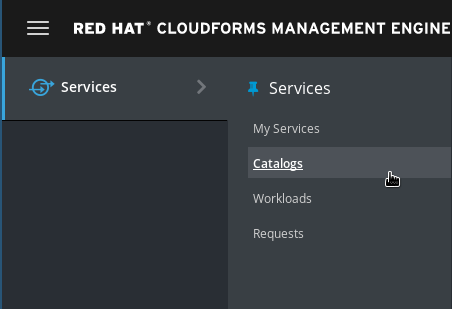

1. Click on the lab "Build a service catalog with CloudForms" and click ***Order***

    

1. Read the details. 

    ***Note:*** Each lab will be automatically deleted after one day and shut down after 8 hours

    

1. Click on ***Submit*** to start the provisioning of the lab

    ***Note:*** It will take up to 15 minutes for the lab to deploy! If you get a "Service unavailable" error when trying to access any of the lab servers, just wait a minute and try to reload.

    ***Note:*** You can only deploy one lab at a given time! If you try to deploy another lab, any previously created labs will be deleted!

## Access the lab environment

***Note:*** Give the lab up to 15 minutes to complete provisioning!

The lab is comprised of a number of systems:

* Red Hat CloudForms Management Engine

        URL: https://cf-lu<number>.labs.rhepds.com

        user: demo / password: r3dh4t1!

* Red Hat Enterprise Virtualization Manager

        URL: https://rhevm-lu<number>.labs.rhepds.com

        user: admin@internal / password: r3dh4t1!

* Red Hat OpenStack Platform

        URL: https://osp-lu<number>.labs.rhepds.com

        user: admin / password: r3dh4t1!

The number &lt;number&gt; matches the number of your lab notebook.

***Note:*** Your browser might give you a warning message about the SSL Certificates. These warning messages can be accepted and are due to the fact that each lab deployed with new certificates on request.

## Verify provider status

Before you start to work on the lab tasks, verify your lab is in a healthy status.

### OpenStack Provider status

Let's first check the OpenStack Provider:

1. Navigate to ***Compute*** -> ***Clouds*** -> ***Providers***

    

1. You should see a tile icon labeled "OpenStack". Click on it.

    

1. Click on ***Authentication*** -> ***Re-check Authentication Status***

    

This will validate the credentials are correct, and it will also restart the provider specific background processes.

The provider tile should show a green check mark and the last update fields should report "less than a minute ago".

### Red Hat Virtualization Provider status

Let's then check the RHV Provider:

1. Navigate to ***Compute*** -> ***Infrastructure*** -> ***Providers***

    

1. You should see a tile icon labeled "OpenStack". Click on it.

    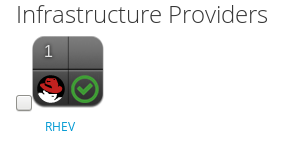

1. Click on ***Authentication*** -> ***Re-check Authentication Status***

    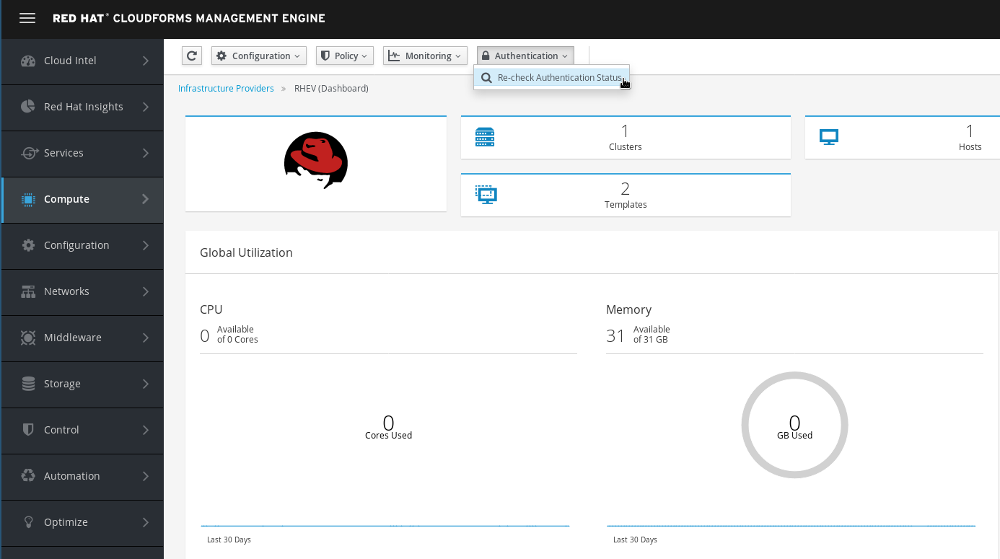

This will validate the credentials are correct, and it will also restart the provider specific background processes.

The provider tile should show a green check mark and the last update fields should report "less than a minute ago". You can click on the little arrow icon to reload the status page.

## What's the value of having a service catalog?

One of the features a Cloud Management Platform provides, is a self service user interface. Here users can order, manage and retire services. Services are categorized in catalogs, where they can be organized and easily consumed.

By providing a service catalog, users can deploy the services they need quickly and simple. This will improve agility, reduce provisioning time and free up resources in internal IT.

### Service Basics

But first some basics. Four items are required to make a service available to users from the CloudForms Self Service Portal:

1. A Provisioning Dialog which presents the basic configuration options for a virtual machine or instance.
1. A Service Dialog where you allow users to configure virtual machine or instance options.
1. A Service Catalog which is used to group Services Catalog Items together.
1. A Service Catalog Item (the actual Service) which joins a Service Dialog, a Provisioning Dialog and some additional meta data.

We can use role Based Access Control to make certain Service Catalog Items available to specific groups of users.

## Virtual Machine Provisioning example

The first example will guide you through the process of offering a Service Catalog Item to provision a simple virtual machine. This will include:

* Create a service catalog: this will allow to organize services in a structured way
* Design a service dialog: a form which will ask the user for the necessary input data
* Publish a service catalog item: puts everything together and build the item which users can order

The following chapters will guide you through the process step-by-step.

### Build a Service Dialog

For this example we will create a Service Dialog which will ask the user for two parameters:

* the name of the new virtual machine
* how much memory should be allocated to the new virtual machine

Follow these steps to design the service dialog:

1. Navigate to ***Automation*** -> ***Automate*** -> ***Customization***

    

1. Navigate to ***Service Dialogs*** in the accordion on the left.

    

1. Click on ***Configuration*** -> ***Add a new Dialog***

1. Chose a label and description:

    ***Label***: Simple VM

    ***Description***: Simple VM provisioning dialog

    ***Note:*** Make sure ***Submit*** and ***Cancel*** are both checked

    ***Note:*** Do not try to save the changes right now! The dialog is not finished and you will receive and error message ("Validation failed: Dialog Simple VM must have at least one Tab")

    

1. Click on the little plus icon in the menu on the top and select ***Add a new Tab to this Dialog***

    Tabs can be used to make complex Service Dialogs easier to navigate and fill out. They are often used to logically structure related questions (e.g. "General Configuration", "Network Configuration", "user Configuration").

    For this lab, we will keep it simple:

    ***Label:*** Generic

    ***Description:*** Generic Tab

    

1. Click on the little plus icon and ***Add a new Box to this Tab***

    Boxes are used to visually group related dialog elements. For example in the network configuration Service Dialog a box could be used to group all IPv4 related questions, and another box to group all IPv6 related questions.

    For this lab we create a simple box:

    ***Label:*** Generic

    ***Description:*** Generic Box

    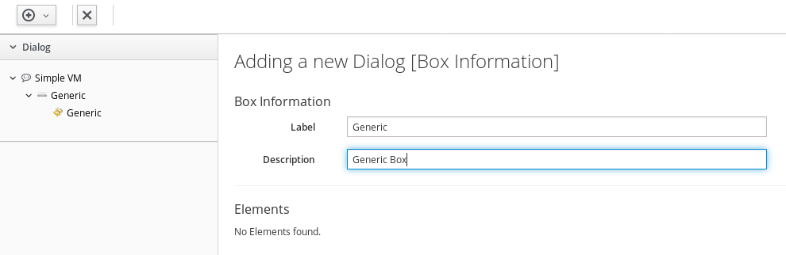

1. Now we can add elements to this box. Click on ***Add a new Element to this Box***

    The first element will allow the user to specify a VM name:

    The Label is the name of the element as it will be shown in the UI:

    ***Label:*** VM Name

    The name will be used for the internal variable of the provisioning workflow:

    ***Name:*** vm_name

    The description is some text which will be shown if the mouse pointer is hovering over this element. It can be used to provide additional information to the user to fill out this field:

    ***Description:*** Specify the name of the new virtual machine

    CloudForms allows us to design Service Dialogs comprised of many different types of Elements:
    
    * Check box: allows to user to check or uncheck the element, often used to ask for additional optional data
    * Date Control: allows the user to select a date from a calender widget. Often used for retirement or other date related options
    * Date/Time Control: same as Date Control, but also allows to specify a time, for example used to specify an automated shutdown or if a change should be scheduled for later
    * Drop Down List: allows the user to select one or multiple options from a list, for example to chose from a list of available networks, applications, cost centers and many more
    * Radio Button: Similar to the check box, but only one of the options can be selected, for example the base OS version (RHEL 6 or RHEL 7, but never more than one)
    * Tag Control: a special element which allows the user to chose from available tags. More about tagging later in this lab
    * Text Area Box: allows the user to enter relatively large amounts of text (multiple lines), could be used for example to provide description information
    * Text Box: allows the user for short amounts of text (one line), in this example we use this element to ask the user for a name of the virtual machine
    
    We want the user to enter a text which then will be used to name the VM. This can be accomplished by selecting "Text Box" in the ***Type*** drop down list.

    

    The remaining options can be ignored for now.

1. We want to add a second element where the user can chose the memory size of the new VM. Click once more on ***Add a new Element to this Box***.

    ***Label:*** Memory size

    ***Name:*** option_0_vm_memory

    ***Description:*** Select how much memory the virtual machine should have

    ***Type:*** Drop Down List

    A element of type "Drop Down List" allows the user to select one of the predefined values. To create the list of selectable values, scroll down to the table "Entries" and add the following lines:

    ***Value:*** 2048

    ***Description:*** 2 GB

    ***Value:*** 4096

    ***Description:*** 4 GB

    ***Value:*** 8192

    ***Description:*** 8 GB

    ***Note:*** To be able to add a line to the table, click on the little "Add this entry" icon on the left of each row!

    

1. We are finally done designing the dialog. Click on ***Add*** to save the dialog.

    ***Note:*** If you're having trouble creating the Service Dialog, you can download it from [Github](https://raw.githubusercontent.com/cbolz/partner-conference-2017-labs/master/cloudforms-service-catalog-lab/service-dialog/simple-vm.yml) and import it. Follow the instructions on how to [import a service dialog](service-dialog-import.md) ONLY if you were unable to create the dialog.

### Build a Virtual Machine Service Catalog

The following steps will create a Service Catalog.

1. The next step is to create a Service Catalog. First we have to navigate to ***Services*** -> ***Catalogs***.

    

1. Click on ***Catalogs*** in the accordion on the left

    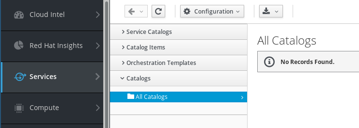

1. Click on ***Configuration*** and ***Add a New Catalog***

1. Fill out name and description:

    ***Name:*** Virtual Machines

    ***Description:*** Deploy Virtual Machines from the Catalog

    

1. Click ***Add*** to save the Service Catalog

### Build a Virtual Machine Service Catalog Item

To tie everything together, the last step is to define a service catalog item.

1. Navigate to ***Services*** -> ***Catalogs***

    

1. Click on ***Catalog items*** in the accordion on the left.

    You should already see two Service Catalogs:

    ***Unassigned:*** Catalog items which are not published yet, will be listed here

    ***Virtual Machines:*** the Service Catalog we just created in the previous step

    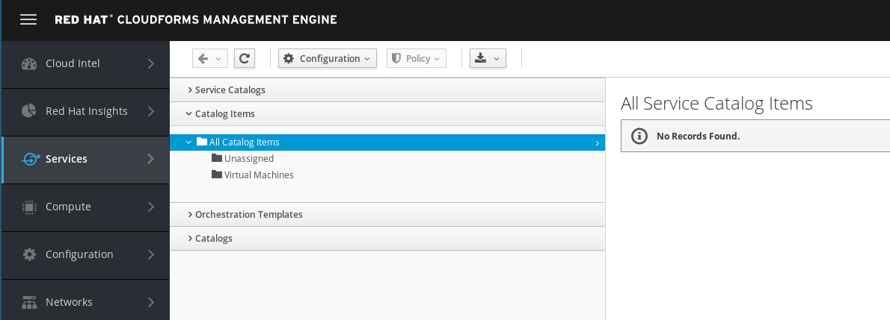

1. In the ***Configuration*** Menu, click on ***Add a New Catalog Item***

    Catalog Bundles are used for multi tier applications and consist of many Catalog Items. Since we do not have any existing Catalog Items, we can not create a Bundle.

1. Chose the Catalog Item Type. For this example we want to use the Red Hat Virtualization Provider, so click on ***RHEV***

    

    ***Note:*** It can take a few seconds for the next screen to load.

1. The next dialog will ask for the details of the new Service Catalog Item:

    The name of the Service Catalog Item shown in the UI:

    ***Name:*** Simple VM

    A more descriptive text about the Service Catalog Item:

    ***Description:*** A simple Linux Virtual Machine

    Check the "Display in Catalog" box. If not selected, the Service Catalog Item will not be visible to users. This can be used for Items which are either still in draft mode, or should only be ordered as a part of a bundle:

    ***Display in Catalog:*** check this box

    Select the previously created Service Catalog:

    ***Catalog:***  Virtual Machines

    Select the previously created Service Dialog:

    ***Dialog:*** Simple VM

    All other fields on this tab can remain unchanged.

    

    Entry Points are the hooks into CloudForms' powerful Automation Framework. It allows administrators to define provisioning, reconfiguration and retirement workflows which are different from the out of the box behavior. For example we could add integration into an IP Address Management Tool, a ticketing system or a CMDB Service. For this lab, we want to stick with the out of the box experience and leave those fields unchanged.

1. Click on the ***Details*** tab. You can provide some more descriptive explanation about the service here. We can even use basic HTML formatting in this box.

        <h1>Simple VM</h1>
        
When ordering this item, the user will be provided some simple questions to specify the hostname and memory size of the requested virtual machine.

        
The VM will be deployed with <a href=http://www.redhat.com>Red Hat Enterprise Linux 7</a>.

1. The ***Request Info*** tab of the dialog allows us to provide all the settings we want to use when provisioning a virtual machine from this Service Catalog Item.

    Select the template used for provisioning:

    ***Selected VM:*** rhel73

    For automatic naming chose "changeme"

    ***Naming:*** changeme

    If no name is specified, this will cause CloudForms to automatically assign a name based on "cfme" as a prefix. The name will be expanded with a unique ID starting with 001.

1. Click on the sub tab ***Environment***

    Although it sounds the most convenient option, we can not use "Choose Automatically". This will require the definition of a provisioning scope, which we haven't done yet. Instead we we set the appropriate values manually.

    The datacenter of our Red Hat Virtualization Provider:

    ***Datacenter:*** Default

    The cluster in the Red Hat Virtualization Datacenter:

    ***Cluster:*** Default

    The host which will perform the actual tasks and where the VM will initially run on:

    ***Host:*** rhelkvm

    The storage domain to store the VM

    ***Datastore:*** vmstore00

1. Click on the next sub tab ***Hardware***

    For the purpose of the lab, the provided defaults are fine.

1. Click on the next sub tab ***Network***

    The lab environment is very simple, there is only one VLAN available:

    ***VLAN:*** rhevm

1. Click on the next sub tab ***Customize***

    This allows to reconfigure certain settings inside the virtual machine. For this lab, we keep them all empty

1. Click on the last sub tab ***Schedule***

    This allows us to delay provisioning to a later time, for example during the night or off hours. We can also set a retirement date. After notifying the user and allowing him or her to extend the lifespan of the virtual machine, retirement will shutdown and, by default, delete the virtual machine.

    For the purpose of the lab, we keep these settings unchanged.

1. Finally click on ***Add*** to save the Catalog Item

    

### Order the Simple Virtual Machine Service Catalog Item

For sure you want to test the Service Catalog Item you just created!

1. Navigate to ***Services*** -> ***Catalogs*** and then click on ***Service Catalogs*** in the accordion on the left.

    

1. You should see the Service Catalog Item we just created:

    

1. Click on the Item to see more details.

    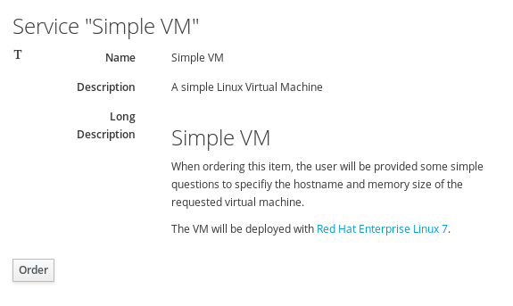

    Note that the Link for Red Hat Enterprise Linux in fact opens the Red Hat Homepage.

1. Click on ***Order***

1. The Service Dialog we created earlier will be presented and ask for the name of the virtual machine and the memory size. As you can see, the name is a free text field, and the memory size is a drop down list.

    Chose an example virtual machine name and the amount of memory you would like to be allocated.

    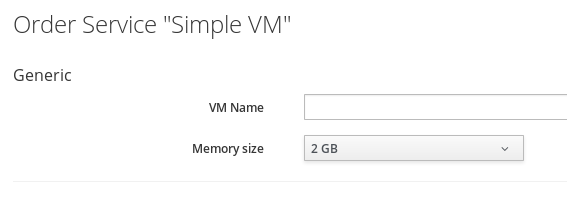

1. You will be redirected to the request queue where you can see CloudForms working on your request.

    

    ***Note:*** Since we are using nested virtualization to run these labs, performance will be slow and it can take several minutes to complete the request (20-30 minutes).

### Verify order

In the requests queue you can click on ***Reload*** to see how CloudForms processes the order. If you click the button a few times, you should see the status is progressing.

We want to log into Red Hat Virtualization to see how the virtual machine is created:

1. Open the Red Hat Virtualization Web UI in a new browser window or tab.

        URL: https://rhevm-lu<number>.labs.rhepds.com

    

1. Click on ***Administrator Portal***

    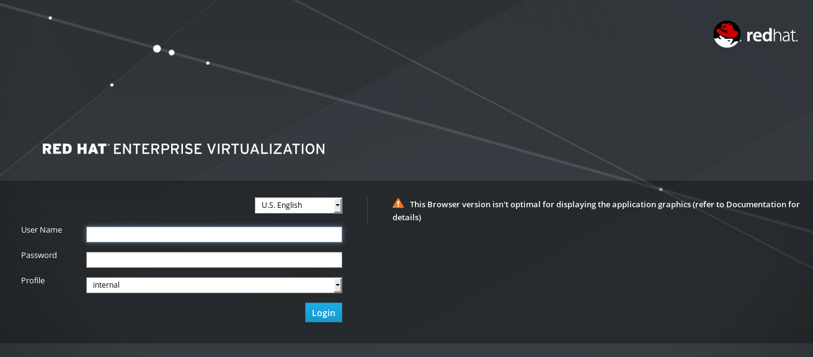

1. Log in with these credentials:

        ***user:*** admin

        ***Password:*** r3dh4t1!

    Make sure the profile is set to "internal".

1. Click on the tab ***Virtual Machines*** to see all existing virtual machines

    

1. After a few moments you're virtual machine should automatically show up in the list.

    

    Note that while the virtual machine is created, the memory size is still 1 GB. This value is specified in the template therefore copied when creating the virtual machine. Only after the virtual machine was successfully cloned, CloudForms corrects the memory size.

    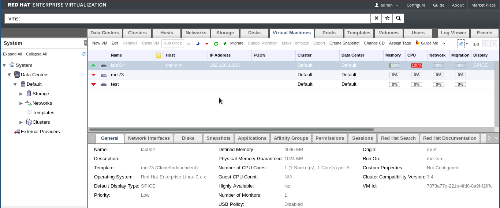

1. This concludes this first part of the lab

## HEAT Provisioning example

In the first part of the lab you have learned:

* how to design a Service Dialog
* how to create a Service Catalog
* put everything together with a Service Catalog Item
* order from the Service Catalog

In the second part of the lab, we want to use HEAT to create a new instance and to provision an application inside the instance. We are using the probably most popular example: [Wordpress](www.wordpress.org). The HEAT template we use, can be found in the [OpenStack Git Repository](https://github.com/openstack/heat-templates/blob/master/hot/F20/WordPress_Native.yaml).

In the previous lab, we had to create a Service Dialog manually. With HEAT, CloudFormations and Microsoft ARM Templates, CloudForms can automatically create a Service Dialog for us. We can still edit this automatically created Service Dialog, to adjust it to our needs.

### Prepare the HEAT Template

Before we can import the template into CloudForms, we need to download it or have it open in a separate browser window.

***Note:*** Please used the forked version of the HEAT Template, which has an additional field "Network" defined. Without this field, running the HEAT Template will fail with an error indicating that mulitple networks are available and hence a network has to be specified.

1. Go to the template on the Github project page.

    [https://github.com/cbolz/partner-conference-2017-labs/blob/master/cloudforms-service-catalog-lab/HEAT/WordPress_Native.yaml](https://github.com/cbolz/partner-conference-2017-labs/blob/master/cloudforms-service-catalog-lab/HEAT/WordPress_Native.yaml)

1. Make sure to open the file in "RAW" mode or use this link:

    [https://raw.githubusercontent.com/cbolz/partner-conference-2017-labs/master/cloudforms-service-catalog-lab/HEAT/WordPress_Native.yaml](https://raw.githubusercontent.com/cbolz/partner-conference-2017-labs/master/cloudforms-service-catalog-lab/HEAT/WordPress_Native.yaml)

1. Download the HEAT Template or open it in a separate browser window so you can copy and paste it into the CloudForms Web UI

### Import the HEAT Template

The following procedure will import a HEAT template, create a service dialog and tie everything together in a service catalog item.

1. Navigate to ***Services*** -> ***Catalogs***

    

1. Click on ***Orchestration Templates*** in the accordion on the left

    

    You should see one existing templates which is provided by CloudForms out of the box. It's a special predefined template to provision virtual machines on Microsoft Azure.

1. Create a new Orchestration template by clicking on ***Configuration*** -> ***Create new Orchestration Template***

1. Give the template a name and description:

    ***Name:*** Wordpress HEAT Template

    ***Description:*** This template can be used to deploy a Wordpress instance on OpenStack

    ***Template Type:*** OpenStack Heat

    Copy and paste the HEAT Template you downloaded before into the large text area below those fields. Make sure you copy the entire HEAT template by opening the [RAW page](https://raw.githubusercontent.com/cbolz/partner-conference-2017-labs/master/cloudforms-service-catalog-lab/HEAT/WordPress_Native.yaml) of the file on Github.

    

    ***Note:*** The screenshot is truncated! Make sure you copy the entire HEAT Template! The first line should be:

        heat_template_version: 2013-05-23

    And the last line should be:

        host: { get_attr: [wordpress_instance, first_address] }

1. Click ***Add*** to save the orchestration template

    

### Create a Service Dialog from a HEAT template

Earlier in this lab you learned how to manually create a Service Dialog. Now we will see that CloudForms can do this work for us, if we use an orchestration template.

1. Navigate to the orchestration template you just created

1. Click on ***Configuration*** -> ***Create Service Dialog from Orchestration Template***

    

1. Enter a name for the new Service Dialog

    ***Service Dialog Name:*** Wordpress HEAT Template

    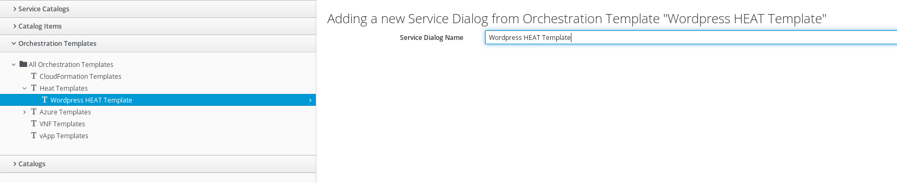

1. Click on ***Save*** to create the Service Dialog

    

### Verify the Service Dialog

The Service Dialog was automatically created. We want to verify it was created properly and has all the expected fields.

1. Navigate to ***Automation*** -> ***Automate*** -> ***Customization***

    

1. Navigate to ***Service Dialogs*** in the accordion on the left.

    

1. Click on the new Service Dialog "Wordpress HEAT Template"

1. A preview will show how the Service Dialog will look like, when it's used in a Service Catalog Item.

    

1. The preview shows us that the Service Dialog is using a default image called "fedora-20.x86_64". We do not have such an image and want to change the Service Dialog accordingly.

1. Click on ***Configuration*** -> ***Edit this Dialog***. Navigate to the element called "Image"

    

1. Change the value of the field "Default Value"

    ***Default Value:*** rhel7.2

    

1. Commit the changes by clicking on ***Save***

    

### Build a HEAT Service Catalog

The following steps will create a service catalog.

1. The next step is to create a service catalog. First we have to navigate to ***Services*** -> ***Catalogs***.

    

1. On this screen click on ***Catalogs*** on the left

    

1. Click on ***Configuration*** and ***Add a New Catalog***

1. Fill out name and description:

    ***Name:*** HEAT Templates

    ***Description:*** Deploy HEAT Templates from the Catalog

    

1. Click ***Add*** to save the Service Catalog

### Build a HEAT Service Catalog Item

To put everything together we create a Service Catalog Item similar to before.

1. Navigate to ***Services*** -> ***Catalogs***

    

1. Click on ***Catalog items*** in the accordion on the left.

    You should already see three Service Catalogs:

    ***Unassigned:*** Catalog Items which are not published yet, will be listed here

    ***Virtual Machines:*** the Service Catalog we created in the first part of the lab

    ***HEAT Templates:*** the Service Catalog you just created

    

1. In the ***Configuration*** Menu, click on ***Add a New Catalog Item***

1. Chose the Catalog Item Type. For this example we want to use HEAT on OpenStack which is an Orchestration provider, so click on ***Orchestration***

    

1. The next dialog will ask for the details for the new Catalog Item

    The name of the Catalog Item shown in the UI:

    ***Name:*** Wordpress

    A more descriptive text about the Catalog Item:

    ***Description:*** Wordpress from HEAT

    Check the "Display in Catalog" box. If not selected, the Catalog Item will not be visible to users. This can be used for Items which are either still in draft mode, or should only be ordered as a part of a bundle.

    ***Display in Catalog:*** check this box

    Select the previously created Service Catalog:

    ***Catalog:*** HEAT Templates

    Select the previously created Service Dialog:

    ***Dialog:*** Wordpress HEAT Template

    The template to execute:

    ***Orchestration Template:*** Wordpress HEAT Template

    Select on which provider the HEAT Template should be executed:

    ***Provider:*** OpenStack

    All other fields on this tab can remain unchanged.

    

    Entry Points are the hooks into CloudForms' powerful Automation Framework. It allows administrators to define provisioning, reconfiguration and retirement workflows which are different from the out of the box behavior. For example we could add integration into an IP Address Management Tool, a ticketing system or a CMDB Service. For this lab, we want to stick with the out of the box experience and leave those fields unchanged.

1. OPTIONAL: Click on the ***Details*** tab. You can provide some more descriptive explanation about the Service Catalog Item. We can even use basic HTML formatting in this box.

1. Finally click on ***Add*** to save the Service Catalog Item

    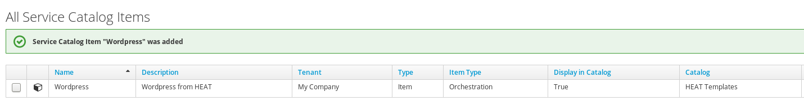

### Order the HEAT Wordpress Catalog Item

For sure you want to test the Catalog Item you just created!

1. Navigate to ***Services*** -> ***Catalogs*** and then click on ***Service Catalogs*** in the accordion on the left.

    

1. You should see the Service Catalog Item we just created:

    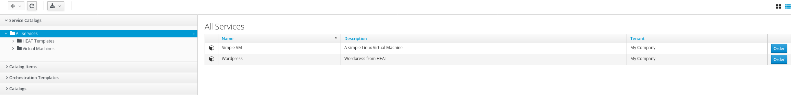

1. Click on the Service Catalog Item to see more details.

    

1. Click on ***Order***

1. Fill out the form:

    Select the tenant into which you want to deploy. There is only one tenant in OpenStack called "admin"

    ***Tenant:*** Admin

    Specify a stack name for your deployment:

    ***Stack Name:*** wordpress001

    For all other fields the provided default values can be accepted. Note that the image name is "rhel7.2" as you specified in your dialog.

    

    Click on ***Submit*** to start the deployment.

1. You will be redirected to the request queue where you can see CloudForms working on your request.

    ***Note:*** Since we are using nested virtualization to run these labs, performs will be slow and it can take several minutes to complete the request (20-30 minutes).

    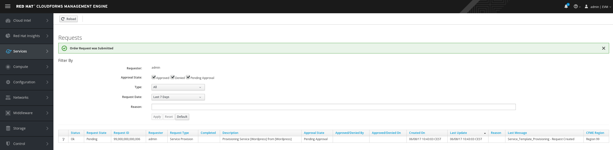

### Verify provisioning in OpenStack

Let's log into OpenStack to see what's happening there.

1. Log into OpenStack:

    [https://osp-lu&lt;number&gt;.labs.rhepds.com](https://osp-lu&lt;number&gt;.labs.rhepds.com)

    ***Note:*** Make sure you use the HTTPS URL!

    ***username:*** admin

    ***Password:*** r3dh4t1!

    

1. Navigate to ***Project*** in the menu bar on the top

    

1. Navigate to ***Orchestration*** -> ***Stacks***

    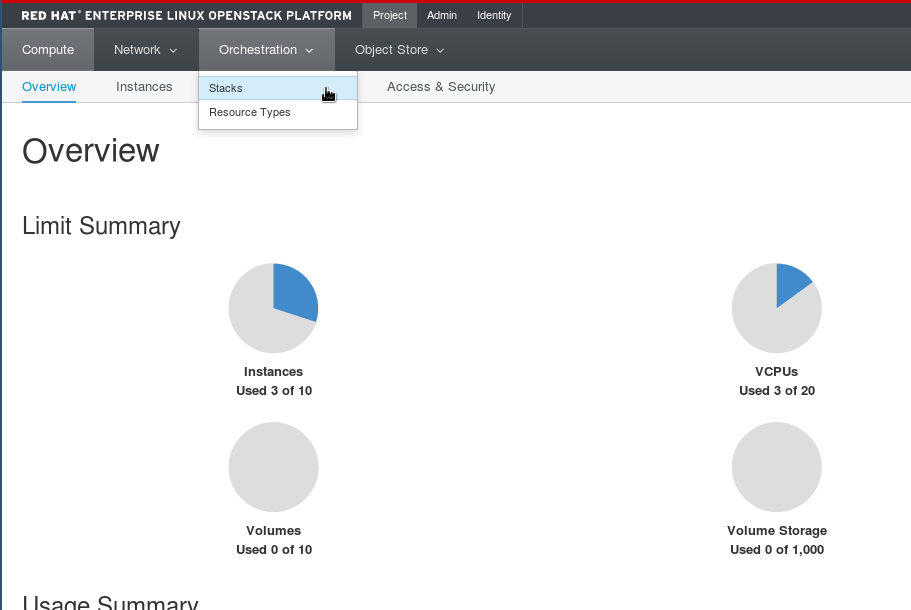

1. You should see your stack. It might already be completed or still in progress.If you can't see it yet, wait a minute and reload the page.

    

1. Click on the stack to get the details

    

This concludes this lab.

## Advanced labs

If you were able to complete all the steps and still have some time left, here are a couple of things you can do to get more familiar with CloudForms.

### Use the Self Service user Interface

The user interface we used so far is often referenced as the "Operations UI" or the "Classic UI". A new, more modern, Self Service user Interface is also available and receives improvements with every release.

The Self Service user Interface can be accessed by appending the string "self_service" to the Appliance URL.

[https://cf-lu&lt;number&gt;.labs.rhepds.com/self_service](https://cf-lu&lt;number&gt;.labs.rhepds.com/self_service)

You can login with the same credentials as before.

### Use role Based Access Control to publish Service Catalog

So far we have created Catalog Items which are visible to any logged in user. In most Enterprise environments, specific Service Catalog items should only be accessible for certain user groups.

CloudForms offers a very granular system for role Based Access Control (RBAC). This allows system administrator to grant or deny specific privileges to reduce visibility, reduce risk of human errors or provide better cost control.

In this advanced lab we want only specific Catalog Items to be available for certain user groups. CloudForms is using tags to identify objects. For example, if a Service Catalog Item is tagged as "Department Engineering" only users which are in a group which is also tagged as "Department Engineering" will see and be able to order this Catalog Item.

#### user groups

A user is always member of at least one user group. The group defines the visibility granted to all member users. For example, members of the group "Department Engineering" can see all objects tagged with this tag.

#### roles

The role defines which actions are allowed to groups associated to this role. For example the role can grant the privilege to start or stop Virtual Machines, manage Service Catalog items, or define and use reports.

Since roles can be associated to multiple groups, they can be reused. A user in Department Engineering might have the same privileges as a user in Department Sales, but they will see different objects which they can interact with.

#### More details

If you want to learn more about CloudForms' role Based Access Control, you can read the [official product documentation](https://access.redhat.com/documentation/en/red-hat-cloudforms/). The chapter [access control](https://access.redhat.com/documentation/en-us/red_hat_cloudforms/4.5/html/general_configuration/configuration#access-control) in the [General Configuration](https://access.redhat.com/documentation/en-us/red_hat_cloudforms/4.5/html/general_configuration/) Guide also provides more background information. Last but not least, there is a good summary about [Using Tags for Access Control](http://cloudformsblog.redhat.com/2016/10/13/using-tags-for-access-control/) on the [official CloudForms Blog](http://cloudformsblog.redhat.com).

### Create a role

For this lab, we first want to create a role which we want to use for testing.

1. Navigate to ***Configuration*** on the top right menu

    

1. Click on ***Access Control*** in the accordion on the left

    

1. Click on ***roles*** and ***Configuration*** -> ***Add a new role***

    

1. We want to define a new role, which has enough privileges to order and interact with Service Catalog Items.

    ***Name:*** Self Server role

    ***Access Restriction for Services, VMs, and Templates:*** None

    Defining the privileges is actually very simple. The tree view allows us to simply select or unselect the privileges we want to grant to users associated to this role.

    1. Let's unselect all items on the first level, except for "Services".

    1. Click on the little triangular icon next to "Services" to open the sub folder. Make sure "My Services", "Workloads" and "Request" are selected.

    1. Click on the little triangular icon next to "Catalogs Explorer" and make sure everything except "Service Catalogs" is not selected.

    The resulting dialog should look like this:

    

1. Click ***Add*** to save the new role

1. Now we want to create a group associated to this role. Click on ***groups*** and ***Configuration*** -> ***Add a new group***

    

### Create a new group

Next we want to create a group and assign it to the role we just created.

1. Create the new group

    ***Description:*** Self Service Engineering

    Select the role "Self Service role" you just created:

    ***role:*** Self Service role

    CloudForms also supports multiple tenants. Since we have not defined any tenants, choose the parent "My Company" tenant:

    ***Project/Tenant:*** My Company

    In "My Company Tags" click on the little triangular icon next to "Department" and click on "Engineering"

    ***Note:*** It is important to only select this particular tag and do not click on any other additional tags!

    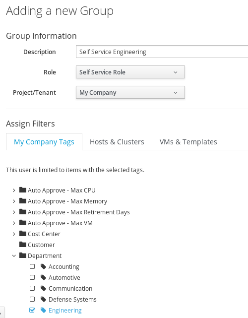

1. Click on ***Add*** to create this new group

### Create a new user

Finally we want to create a user which is a member of the group we just created.

1. Click on ***users*** and ***Configuration*** -> ***Add a new user***

    

1. Create a new user with these parameters:

    ***Full Name:*** Joe Doe

    ***username:*** joe

    ***Password:*** r3dh4t1!

    ***Confirm Password:*** r3dh4t1!

    ***E-mail Address:*** joe@example.com

    ***Note:*** CloudForms is not configured to send out emails, but the email address is a mandatory field

    ***group:*** Self Service Engineering

    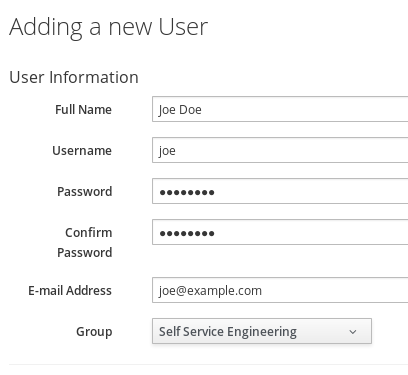

    Click on ***Add*** to create the user

### Test user Joe Doe

So far we have not assigned any objects to the new group, but we have granted very specific rights to members of that group.

Let's see what happens if we log into CloudForms as "Joe Doe".

***Note:*** You can not log into CloudForms with different users while you're in the same browser session. You have to log out and log in again. As an alternative, you can use a different browser, if available, or you can open an additional window in "private" mode.

1. Log out of CloudForms by clicking on the user name on the top right and click on ***Logout***

    

1. Log in as user Joe Doe:

    ***username:*** joe

    ***Password:*** r3dh4t1!

    

1. You should notice that most of the menus are gone now. On the top level menu on the left, we can only click on ***Services*** and have only four sub menus available.

1. Navigate to the service catalog

    

1. You should notice that there are no Catalog Items available! Although we have defined some Catalog Items earlier in this lab, none of them are available to the "Self Service Engineering" group.

1. Let's logout again

    

### Grant access to certain Catalog Items

We want to make one Catalog Item available to all users which are members of the "Self Service Engineering" group.

1. Log into CloudForms as admin

1. Navigate to ***Services*** -> ***Catalogs***

    

1. Click on ***Catalog Items*** in the accordion on the left

    

1. Click on ***Virtual Machines*** and ***Simple VM***

    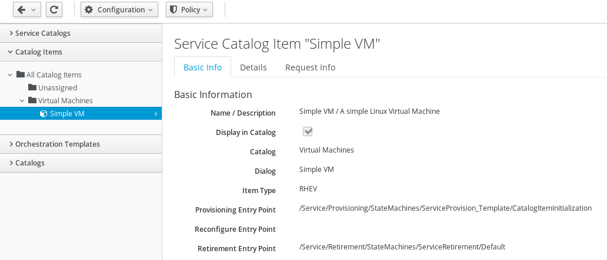

1. Click on ***Policy*** -> ***Edit Tags***

    

1. Assign the Tag "Department" / "Engineering" to the Catalog Item

    

1. Click ***Save*** to commit the changes

### Test once more as Joe Doe

We want to do another test and see if the user Joe Doe can now see and other the Catalog Item.

1. Log out

    

1. Log in as Joe Doe

    

1. Navigate to ***Services*** -> ***Catalogs***

    

1. Now you should see one Service Catalog Item: "Simple VM" - but no other Service Catalog Items.

    

1. If you want, you can order the Service Catalog Item and should see that it will be deployed perfectly.

## Even more?

With what you've learned so far, you could try a couple of things on your own. Here are some ideas:

* make the second Catalog Item available for Joe Doe as well
* improve the Service Dialog and make the VM Name a mandatory field (right now, it's optional and can be left empty)
* grant Joe Doe more privileges (for example, it would be nice if he could start and stop hie virtual machines)
* upload items to make the Service Catalog more appealing
* use the new Self Service user Interface by trying the "/self_service" URL on your Appliance
